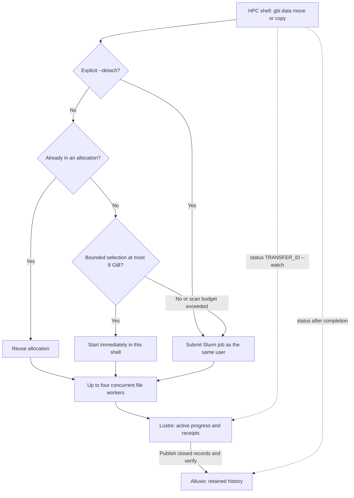
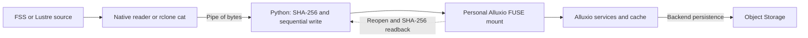
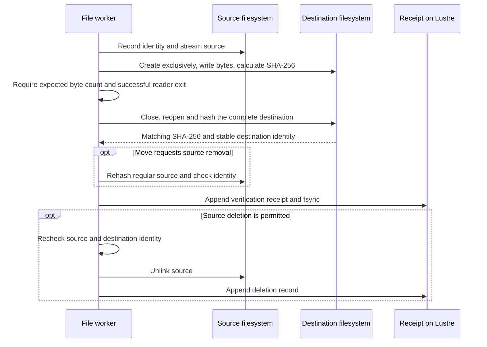

# GBI data CLI architecture

This describes **gbi 0.3.2**, extending the verified worker introduced in [PR #7 — verified data movement with
Slurm and terminal progress](https://github.com/EIT-GBI/GBI-Compute-Software-Modules/pull/7).
The deployed settings below were checked on 9 September 2026. Site paths,
user identities and credentials are deliberately omitted from this public report.

## What actually moves the data?

The CLI moves data through **mounted filesystem paths**. For a regular file,
**native I/O or rclone reads the source; Python writes the destination and
checks the bytes**. An Alluxio destination therefore goes through the existing Alluxio
mount. Alluxio's storage service handles persistence to Object Storage.

| Question | Current implementation |
| --- | --- |
| Does it use rclone? | For everyday and bulk transfers: parallel `rclone cat` readers supply source streams. Tiny selections use native I/O. Python performs the destination write, SHA-256 verification and source deletion. |
| Does it run on the Prefect partition? | No. Bulk/background submission uses the configured Slurm partition, currently `cpu`. |
| Does it launch a Prefect flow for a large directory? | No. Up to 8 GiB runs immediately in the shell; bulk work uses Slurm. |
| Does the CLI PUT directly into Object Storage? | No. It configures no cloud remote and has no direct Object Storage upload or download client. Alluxio owns that connection. |
| Does every data transfer pass through Alluxio? | FSS/Lustre payloads go directly between those filesystems. Their completed transfer history still goes to Alluxio. |

## Execution and progress

`module load gbi` loads the shared Python CLI and pinned `rclone/1.75.1`
dependency. The CLI resolves paths using configured personal roots and the
execution node's mount table; Unix permissions determine access to shared paths.
It snapshots its Python code and site configuration onto Lustre, and chooses
foreground execution, the current allocation or `sbatch --parsable`.
There is no identity switch or service account in the CLI.

Alluxio FUSE mounts and Alluxio-backed NFS exports retain Object Storage source
protection, including the instrument mounts. They can be copied to any writable
destination; there is no instrument-to-testbed allowlist. Ordinary filesystem
paths use POSIX behavior. Public personal roots remain the defaults shown by
`roots` and the locations for scratch/history.

Placement and reader selection are independent:

| Selected workload | Execution outside an allocation | Reader |
| --- | --- | --- |
| Up to 8 MiB and 32 files | Immediate foreground | Native I/O |
| Larger selection, up to 8 GiB | Immediate foreground | Parallel rclone readers |
| More than 8 GiB | Slurm | Parallel rclone readers |
| Metadata probe exceeds 5 seconds or 100,000 visited entries | Slurm | Parallel rclone readers |
| Explicit `--detach` | Slurm | Parallel rclone readers |

The same defaults apply to all filesystem directions. Site configuration can
change them through the module recipe. The probe reads metadata, never payload
checksums. Its bounded foreground snapshot rejects changed selected files;
files appearing later are not part of that request. Bulk discovery streams
into the pool. There is no short foreground duration cutoff.

The Slurm request is **2 CPUs, 4 GiB and 24 hours**. Both execution paths allow
**four concurrent files per invocation**; there is no global concurrency
limiter. Each file has a supervised process and timeout. A single file remains
a sequential stream: parallelism is across files, not concurrent writes into
one Alluxio object.

Progress uses structured snapshots and shows copying, closing, destination
verification and source rechecking. Foreground calls wait and Ctrl-C stops
them. For submitted jobs, Ctrl-C detaches the viewer and
`status TRANSFER_ID --watch` reconnects. `--detach` is the explicit choice
for work that must survive a shell disconnect.

## File bytes and Alluxio

For an archive into Alluxio, the data path is:

The CLI opens the regular source without following a symlink, then gives rclone
an inherited file descriptor selected through a one-entry `--files-from-raw`
list and `--no-traverse` ([rclone filtering semantics](https://rclone.org/filtering/#files-from-read-list-of-source-file-names)).
This avoids pathname-encoding surprises and listing unrelated transient
descriptors. Tiny selections read the same pinned descriptor natively.
It uses an empty rclone configuration and disables multithreaded reads of that
one file. Parallelism is across files. The writer creates the destination
exclusively at its final name: it does not rename a large temporary object over
it or truncate an existing Alluxio file.

On restore, the selected reader reads the mounted Alluxio source and Python writes to Lustre
or FSS. Alluxio may satisfy the read from cache or fetch it from Object Storage.
The checked compute node presented a direct `fuse.alluxio-fuse` mount, as shown
above. NFS presentations, where configured, are an infrastructure detail; the
CLI uses the supplied POSIX path in either case.

Alluxio must have accepted write-through persistence; the checked deployment
uses `CACHE_THROUGH`. A successful client `close()` is insufficient evidence
on its own: completion can be asynchronous, so the CLI waits for a successful
full destination readback. **That readback is through the mount and can use
cache. It is not an independent Object Storage GET or proof that the CLI has
inspected backend multipart-upload state.**

## Verification, deletion and recovery

`copy` keeps sources. `move` removes verified FSS/Lustre sources;
**Alluxio sources remain unless `--delete-source` is explicit**. Deletion is
per file, so a partially failed directory move can contain both completed moves
and retained sources. Inputs must be quiescent; the CLI does not lock out
applications writing their data. Rehashing the source catches same-size edits
that coarse filesystem timestamps alone can miss.

An identical existing destination is checked and reused. A differing destination
is retained and reported. Retry journals and shared destination lock stripes
permit replacement only of this CLI's recorded incomplete output with an
unchanged source. These journals do not import parcopy's retry ownership.

At completion, closed logs, receipts and the final summary are copied into
Alluxio's `.gbi/transfers/TRANSFER_ID/` tree and read back before the temporary Lustre
run directory is removed. History publication failure retains scratch evidence
and reports failure. Foreground history uses one immutable `history.json`
bundle to reduce small-object publication overhead. FSS stores the installed code and configuration; it does
not accumulate transfer history.

## Implementation and limits

| Source | Responsibility |
| --- | --- |
| [storage.py](src/lib/gbi_data/storage.py) | Site settings, user-root resolution and reserved paths |
| [selection.py](src/lib/gbi_data/selection.py) | Bounded metadata probe and streaming selection |
| [cli.py](src/lib/gbi_data/cli.py) | Placement and reader choice, worker supervision, request snapshots and history publication |
| [jobs.py](src/lib/gbi_data/jobs.py) | Slurm submission, status and terminal display |
| [transfer.py](src/lib/gbi_data/transfer.py) | Copy stream, checksums, retry ownership, receipts and deletion |
| [Module recipe](sm-config/settings.toml) | Shared installation and [Lmod dependency/configuration](sm-config/module_template.lua) |

Symlinks are copied as links on native filesystems and represented by
`.rclonelink` objects through Alluxio. Original Unix modes/timestamps are not
preserved through Alluxio; ACLs, extended attributes and hard-link relationships
are not replicated. The CLI requires Lustre for active state and Alluxio for
retained history even when moving a payload between FSS and Lustre.

The underlying worker validation covered all six filesystem directions, real Alluxio partial-write
recovery, locks across distinct hosts and two four-file 12 GiB moves at about
59 MiB/s including verification and history publication. These are bounded
test results, not a throughput guarantee. In the instrumented run, roughly
25 seconds per file wrote the bytes, while destination readback took 46–169
seconds including completion waits. That does not isolate backend queueing,
upload or read cost. Changing Alluxio upload concurrency or streaming belongs
in its infrastructure configuration; the CLI does not change those settings.

See the [user and installation guide](README.md) for commands and the
[implementation specification](SPEC.md) for the scope of this release.

The 0.3.0 adaptive candidate also passed all six 5 KB routes from a login shell,
a four-file 512 MiB foreground archive in 14.9 seconds and a 2 GiB foreground
archive in 43.4 seconds. Those times include verification and history. Explicit
background submission and existing-allocation reuse passed. The above-8-GiB
automatic boundary was checked with metadata-only dry runs and local submission
tests; this was not another bulk throughput benchmark.
